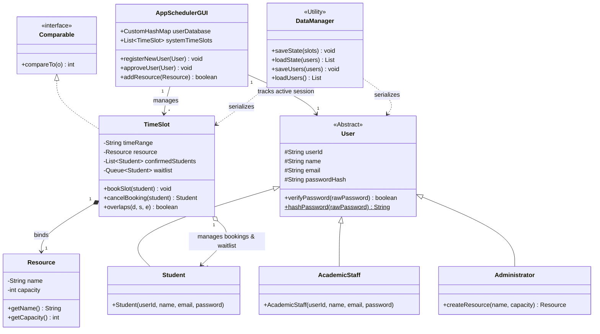

# System Design & UML Class Diagram

This document describes the Object-Oriented Programming (OOP) design and inheritance relationships of the TimeTable scheduling system, including a streamlined, high-level Mermaid UML Class Diagram.

## I. Application of OOP Principles

The codebase strictly adheres to the core tenets of Object-Oriented Programming to ensure structural modularity, maintainability, and scalability:

1.  **Abstraction**: The `User` class is declared `abstract`. It encapsulates common properties of all human actors in the system (e.g., credentials, hashed passwords) but prevents direct instantiation, as a generic "User" has no operational meaning without a specific role.
2.  **Inheritance**: Concrete roles (`Student`, `AcademicStaff`, `Administrator`) inherit from `User`. They inherit all base attributes (e.g., `userId`, `email`, `passwordHash`) and constructors, reducing code redundancy.
3.  **Encapsulation**: State variables across all models (`TimeSlot`, `User`, `Resource`, `Notification`) are marked `private` or `protected`. State changes are restricted to public interface methods (e.g., `bookSlot()`, `cancelBooking()`, `checkIn()`), protecting the internal lists and queues from direct external manipulation.
4.  **Polymorphism**: The controller (`AppSchedulerGUI`) manages collections of the generic type `User`. During runtime execution (e.g., loading persistent data, verifying credentials), polymorphic behavior is leveraged via inheritance type-checks (`instanceof`) to route actors to their role-specific interfaces.
5.  **Interface Realization**: The `TimeSlot` class implements Java's standard `Comparable<TimeSlot>` interface. By overriding `compareTo(TimeSlot other)`, it implements a natural chronological sorting contract, allowing instances to be ordered inside the custom Binary Search Tree.

---

## II. Streamlined Mermaid Class Diagram

This diagram displays the main classes only, focusing on inheritance (`<|--`), interface implementation (`<|..`), and associations without cluttering the final report layout:

