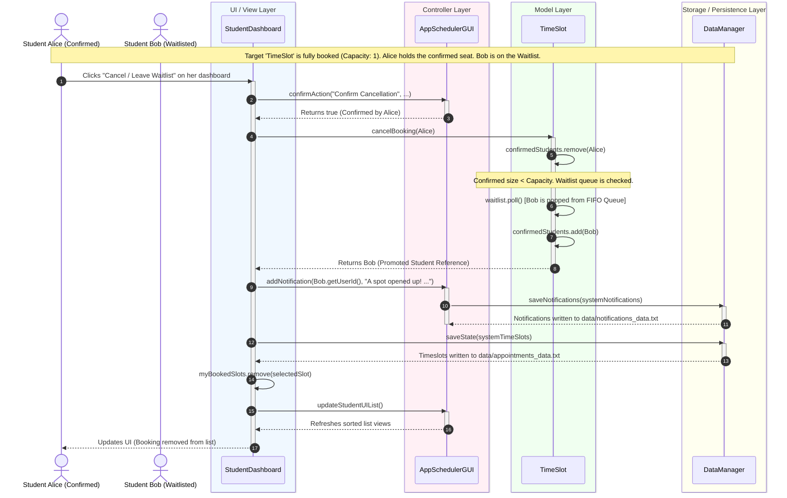

# System Interaction & Sequence Diagram

This document describes how components inside the TimeTable application interact during the core scheduling and booking use cases, structured across architectural layers: **UI View**, **Controller**, **Model**, and **Storage/Persistence** layers.

## I. Model-View-Controller (MVC) Architecture

To enforce clean separation of concerns, the application structure separates state, representation, and coordination logic:

*   **Model (Domain State)**: Encapsulated inside `users` and `scheduling` packages. These classes (`User`, `Student`, `AcademicStaff`, `Administrator`, `Resource`, `TimeSlot`, `Notification`) define data fields and strict domain methods. They contain no GUI code and are completely independent of JavaFX.
*   **View / UI Layer**: Created programmatically in the `gui` package. Classes like `LoginScreen`, `SignUpScreen`, and the dashboards construct the layout controls (`GridPane`, `HBox`, `ListView`, `Button`, `TextField`) and define the visual theme using static configurations from `AppStyles.java`.
*   **Controller Layer**: Managed by `AppSchedulerGUI` (which initiates the application, hosts central observable references, and coordinates scene transitions) and the interactive handlers within the dashboards. They register event listeners (e.g., button actions, mouse clicks, drag handlers) on the Views, manipulate the Models based on user inputs, and save changes to disk.
*   **Storage / Persistence Layer**: Controlled by the utility `DataManager` which writes and reads pipe-delimited data directly to local flat-files inside `/data/`.

---

## II. Sequence Diagram: Booking & Waitlist Queue Promotion

This diagram displays the dynamic transaction flow when **Student Alice** cancels a confirmed booking in a fully booked room, triggering the system to automatically promote **Student Bob** from the waitlist queue to a confirmed seat:

