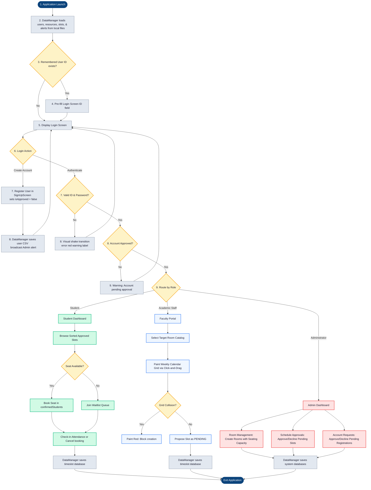
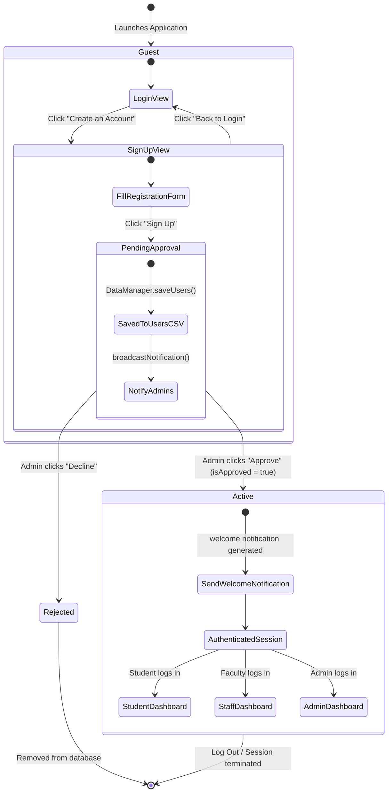
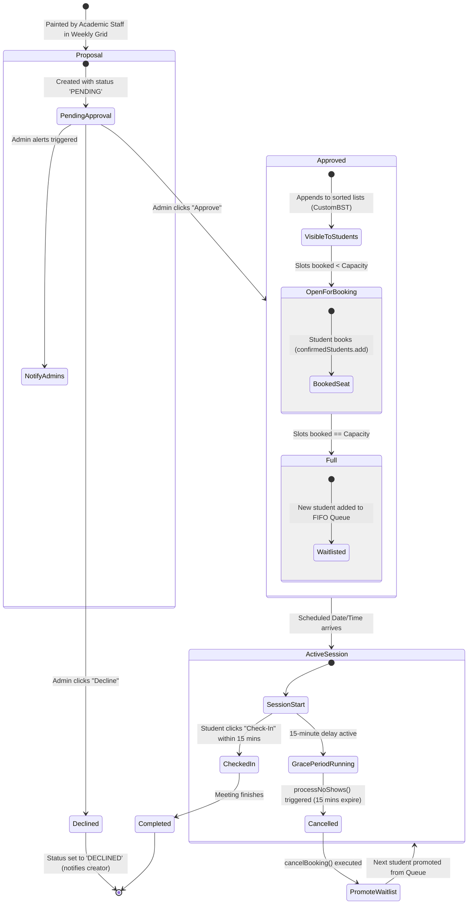

# System Workflow & State Lifecycle

This document describes the operational workflows for each user role and outlines the lifecycle states of critical domain entities inside the TimeTable application.

## I. Mermaid Flowchart: Overall Application Workflow

This flowchart outlines the complete operational lifecycle from application launch, de-serialization of persistent flat-files, login gatekeeping, role-based routing, and primary actions within each dashboard:

---

## II. Entity State Lifecycle Diagrams

### State Diagram A: User Account Lifecycle
This diagram illustrates the state transitions a user account undergoes from sign-up through administrative validation to active system usage:

### State Diagram B: Timeslot Scheduling Lifecycle
This diagram tracks a scheduling timeslot block from creation by faculty, through validation, booking, and final resolution (check-in or no-show cancellation):

